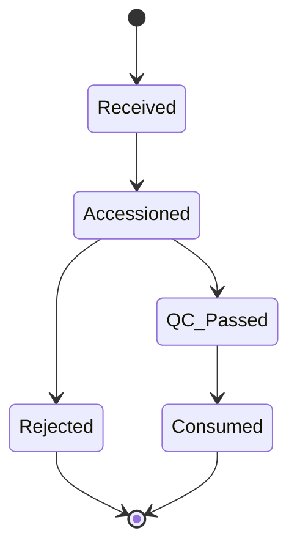
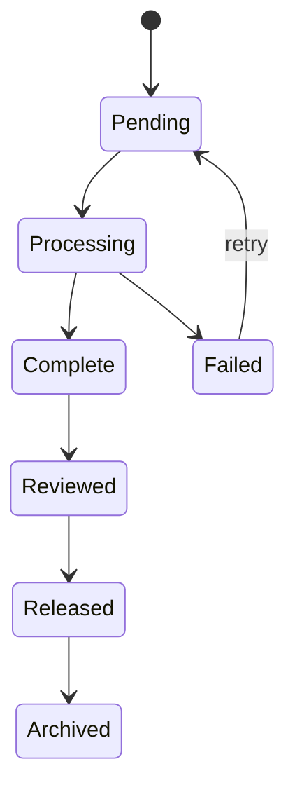
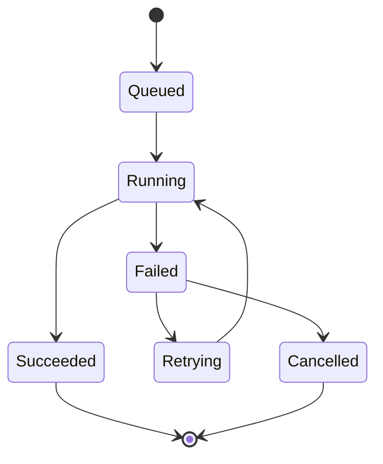
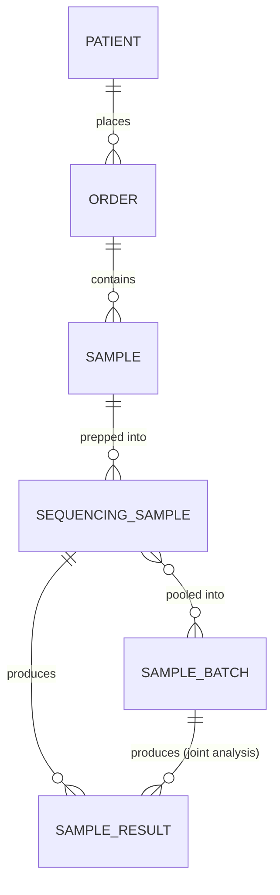
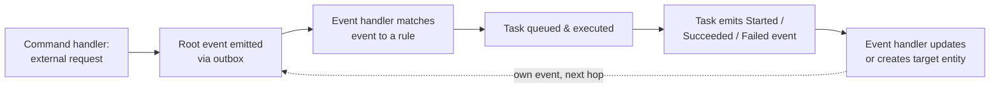

# Entity–event–task architecture for a sequencing lab platform

## 1. Design philosophy

The model has three layers, each answering a different question. Entities are nouns — they hold state and persist (patient, order, sample, sequencing sample, sample batch, sample result). Events are immutable facts — a timestamped record that something happened, written once and never changed (sequencing ready, analysis task started, analysis task succeeded). Tasks are verbs — asynchronous units of work with their own lifecycle, decoupled from the entities they act on (bioinformatics pipeline analysis, data archiving).

These three layers form a closed loop rather than a one-way pipeline: an entity's state change is recorded as an event; an event triggers a task, or is reacted to directly; a running task itself emits events describing its own progress; those events update entity state (or create new downstream entities), which can trigger the next event and the next task. Entities and tasks never call each other directly — the event log is the only channel between them.

A useful simplification that came out of working through the details: a task is genuinely just another entity — its execution status is a state machine like any other entity's, it's created in reaction to an event like any other entity mutation, and it emits its own events on transition like any other entity. The system really only has two primitives (entity, event), not three; "task" is a specialization of entity whose domain is execution rather than lab process. The implementation schema below reflects this literally.

The overall pattern combines a few well-known, named patterns rather than inventing something new: the **transactional outbox** pattern (atomically writing an entity's state change and its event together), the **aggregate** pattern from Domain-Driven Design (the boundary of what one such transaction may touch), and **unit of work** (Fowler's general term for the mechanism that coordinates and commits a set of changes together). Knowing the official names matters for looking up further reading and for talking to other engineers about the same ideas without re-deriving them.

## 2. Entity model

### 2.1 Core entities (conceptual)

| Entity | Represents | Key attributes | Parent (provenance) |
|---|---|---|---|
| Client | The ordering institution or practice that submits orders — the lab's customer, distinct from the Patient | client_id, account_number, billing contact, status | — (root) |
| Patient | Root clinical identity | patient_id, MRN, demographics | — (root) |
| Order | A test requisition | order_id, patient_id, ordering_provider, test_panel, status | Patient (and the Client that placed it) |
| Sample | A physical specimen | sample_id, order_id, specimen_type, collection_date, status | Order |
| Sequencing sample | A prepped library/aliquot ready for sequencing | seq_sample_id, sample_id, library_prep_protocol, barcode/index, concentration, status | Sample |
| Sample batch (Illumina run) | A physical sequencing run pooling many sequencing samples | batch_id, run_id, instrument, flow_cell_id, status, run QC metrics | Sequencing sample (many-to-many) |
| Sample result | Pipeline output for one or more sequencing samples | result_id, seq_sample_id and/or batch_id, pipeline_version, reference_genome, output_location, status | Sequencing sample and/or Sample batch |
| Task | An asynchronous unit of work | task_id, task_type, target entity, status, retry_count | The event that triggered it |

The chain from patient to result is mostly linear (Patient → Order → Sample → Sequencing sample) but stops being strictly 1:1 at the run and result stages: a batch pools many sequencing samples, and a result can derive from one sequencing sample or, in joint-analysis workflows, from several samples in a batch at once. A rigid parent_id chain breaks down at that point — see §2.4 and §6.1 for how lineage is actually modeled through fan-in points.

### 2.2 Entity state machines

Every entity type owns its own finite state machine; status is a constrained enum with defined transitions, not free text.


*Sample lifecycle*


*Sample result lifecycle*


*Task lifecycle — same shape for pipeline analysis and archiving tasks*

Each transition is caused by, and recorded as, an event — the state machine and the event catalog are two views of the same thing.

### 2.3 Entity relationship diagram (conceptual)



### 2.4 Implementation: the unified entity table

Two ways to physically implement §2.1–§2.3 were worked through. **The unified polymorphic table is the chosen design** — it is what `entity_schema_unified.sql`, `models.py`, `outbox.py` and `demo.py` implement, and the only entity schema in this repository. The alternative is recorded at the end of this section because the trade-off it lost on is worth understanding, not because it remains open.

A single `entity` table for every entity type, with:

- `category` / `subcategory` — a taxonomy (`Sample` / `library_sample`, `Task` / `data_archiving`, etc.), validated against a small `entity_type` lookup table rather than hardcoded into the schema. Adding a new subcategory is a data change (`INSERT INTO entity_type`), not a migration.
- `name` — a human-readable identifier, unique per `(category, subcategory)` rather than globally, so an accession number and a run name can't collide with siblings of their own type but can coincidentally match across types.
- `attributes JSONB` — everything specific to one subcategory (specimen_type, flow_cell_id, pipeline_version, …) that would otherwise be a dedicated column on a dedicated table.
- `entity_relationship` — a single graph table (`parent_entity_id`, `child_entity_id`, `relationship_type`) carrying *every* lineage edge, both the simple 1:N ones that would have been ordinary foreign keys (`sample.order_id`) and the fan-in ones that would have needed a separate link table. A Task's target entity and the result it produces are just edges in this same table, since Task is folded into `entity` too.
- `entity_status` + a `BEFORE INSERT OR UPDATE` trigger — since a plain `CHECK` constraint can't validate a column against another table, status is validated by trigger against a lookup of valid `(category, subcategory, status)` combinations. This is the polymorphic replacement for the per-table `CHECK (status IN (...))` constraints.

The trade-off: the database can no longer enforce a given subcategory's attribute shape via column types — that validation moves to the application layer (or a JSON Schema check on `attributes`), and a foreign key value sitting inside `attributes` (e.g. a Task's `triggering_event_id`) isn't referentially enforced by the database, only `entity_relationship` edges are. What's gained: one table, one index set, and — because every entity now lives in one place with one primary key space — the event log's `entity_id` can finally be a real, enforced foreign key (`events.entity_id → entity.id`), which wasn't possible when entities were spread across six separate tables.

`models.py` implements the unified design as SQLAlchemy 2.0 ORM classes, using single-table polymorphic inheritance (`polymorphic_on=category`) so `Task`, `Patient`, `Sample`, etc. are literal Python subclasses of `Entity` backed by the same table — confirming in code what §1 states conceptually: a task is an entity.

**Considered and rejected: per-entity-table.** One table per entity type (`patient`, `lab_order`, `sample`, `sequencing_sample`, `sample_batch`, `sample_result`, `task`), ordinary foreign keys for the 1:N hops, and a generic `entity_link` table for the fan-in points a simple FK can't express (batch pooling, joint results). Its advantage was real: column-level typing per entity type, and each entity's state machine expressible as an ordinary `CHECK (status IN (...))` constraint rather than a trigger against a lookup table. It lost on the two points above — every new entity subcategory would need a schema migration instead of an `INSERT INTO entity_type`, and with entities spread across six tables the event log's `entity_id` could only ever be a loose `(entity_type, entity_id)` pair with no referential integrity behind it. The DDL for this option was removed once the decision was made, so that the repository holds exactly one authoritative entity schema.

## 3. Event model

### 3.1 Event envelope schema

An event's fields split into two groups: metadata about the event itself (the envelope) and the domain-specific data (the payload). Provenance/tracing fields belong in the envelope, never mixed into the payload — that keeps every event type's payload free of repeated bookkeeping and gives tooling one predictable place to find "who/what/when caused this," regardless of event type.

| Field | Purpose |
|---|---|
| event_id | Unique identifier |
| event_type | e.g. `SequencingReady`, `AnalysisTaskSucceeded` |
| schema_version | For safe evolution of the payload shape |
| entity_type / entity_id | The entity the event is about |
| correlation_id | Ties together every event in one patient→order→...→result journey |
| causation_type / causation_id | What directly caused this event — an `event` or a `task` (polymorphic pair, not a single FK, since a task isn't a row in the events table) |
| trace_id | Optional distributed-tracing id (OpenTelemetry), for cross-service debugging — a different, lower-level kind of tracing than correlation_id |
| source | The producing service (e.g. `pipeline-orchestrator`), distinct from actor |
| producer_version | Build/deploy version of the producing service, useful when debugging a bad event from a specific deploy |
| actor_type / actor_id | System, worker, or user that produced it, and on whose behalf |
| payload | Event-specific business data (JSON) |
| occurred_at | Business time — when the fact actually happened |
| recorded_at | Write time — when this row was committed (diverges from occurred_at mainly on backfills) |
| published_at | Outbox relay bookkeeping — null until relayed to the bus |

Adopting the CloudEvents spec's envelope shape (`source`, `id`, `type`, `time`, `subject`, `data`) is a reasonable off-the-shelf alternative to defining this envelope from scratch.

### 3.2 Event catalog

**Domain (entity lifecycle) events** — describe an entity's own state change, named past-tense on the entity: `SampleReceived`, `SampleAccessioned`, `SampleRejected`, `SequencingSamplePrepped`, `SequencingReady`, `RunStarted`, `RunCompleted`, `RunFailed`, `ResultReleased`.

**Task lifecycle events** — describe a task's own progress: `AnalysisTaskStarted`, `AnalysisTaskSucceeded`, `AnalysisTaskFailed`, `ArchivingTaskStarted`, `ArchivingTaskSucceeded`, `ArchivingTaskFailed`.

Domain events typically *trigger* task creation; task events typically *cause* the target entity to transition.

### 3.3 correlation_id, and tracing through fan-in points

correlation_id is generated once (at Order creation) and carried forward unchanged onto every downstream entity and event in a linear chain — one query against it reconstructs a whole patient's journey. It works cleanly wherever the lineage is genuinely 1:1.

It breaks down at fan-in points, and the fix is to stop asking a single scalar field to do that job:

- Events that are still "about" one sample (`SequencingSampleLoadedIntoBatch`) keep that sample's own correlation_id.
- Batch-level events (`RunStarted`, `RunCompleted`, `RunFailed`) aren't about any single patient, so they don't carry one correlation_id at all — batch-level facts are scoped by `batch_id`, and "which patients were in this run" is answered by querying `entity_relationship` for everything linked to that batch, not by a correlation_id field.
- When a batch-level event fans back out per-sample (e.g. `RunCompleted` spawning one analysis task per sequencing sample), the orchestrator looks up each sample's original correlation_id via the lineage graph and re-stamps it onto that sample's downstream events — correlation_id "resumes" once you're back to processing a single sample's result.

Joint-analysis Sample Results (derived from several samples in a batch) are the same situation: no single correlation_id, lineage established via the relationship graph instead.

### 3.4 The transactional outbox pattern

Writing to the entity table and publishing to the event bus can't be one atomic operation — they're different systems with no shared transaction. Naively doing both as separate steps risks the entity updating with no event ever published (or the reverse) if the process crashes in between.

The fix: write the event into a plain table in the *same* database, in the *same* transaction as the entity change.

```sql
BEGIN;
UPDATE sample_result SET status = 'Complete' WHERE id = :id;
INSERT INTO outbox (event_id, event_type, payload, published) VALUES (..., 'AnalysisTaskSucceeded', ..., false);
COMMIT;
```

Both writes succeed or both roll back — ordinary ACID, no distributed transaction. A separate relay process (a poller reading `WHERE published = false`, or a CDC tool like Debezium) then actually publishes each row to the bus. This is the official, industry-named **transactional outbox** pattern (Chris Richardson's microservices.io catalog). The scope of what one such transaction may touch is called an **aggregate** in DDD — "one transaction, one aggregate" is the same rule as "never write a second entity's data inside the transaction that's really about the first entity's own state change" (see §5.2). The general-purpose mechanism used to coordinate and commit the writes together is a **unit of work** (Fowler) — in practice, an ORM session's commit boundary.

The outbox table itself doubles as the durable, replayable event log if rows are kept indefinitely (`published_at` flipped rather than the row deleted) — no separate archival consumer needed. If outbox rows are purged after relay instead (common, since the outbox sits on the hot write path), a dedicated archival consumer subscribed to the bus, appending every event into a separate long-term store, fills that role instead.

### 3.5 Replaying an event

Replay means re-delivering the exact historical record — same `event_id`, same payload, same `occurred_at` — never fabricating a new event that merely resembles the original. Minting a new id or timestamp would break the causation chain anything downstream references.

- If the bus itself retains history (Kafka-style), replay is resetting one consumer group's offset; the broker re-delivers what it already has, scoped naturally to that one consumer.
- If the bus doesn't retain history, the durable event store (the outbox/event-log table) is the real source of truth: read the row back out and either re-publish it (identical payload/id) or, more precisely, invoke the target handler directly, bypassing the bus so other subscribers that already processed it correctly aren't re-triggered.
- Whichever mechanism, the target handler's own idempotency checkpoint (§5.3) needs to be cleared (or upserted) for the event(s) being replayed, or the handler will see "already processed" and no-op.

### 3.6 Event bus vs. task queue

These solve different distribution problems and shouldn't be conflated:

| | Event bus | Task queue |
|---|---|---|
| Consumer pattern | Fan-out — every subscriber gets its own copy | Competing consumers — exactly one worker gets each message |
| Content | An immutable record of something that happened | An instruction: "go do this" |
| Retention | Often retains/replays history | Ephemeral — gone once acked |
| Role in this model | Carries domain and task-lifecycle events to handlers | Distributes actual task execution across a worker pool |

A handler reacting to a domain event by deciding "go do real work" typically bridges the two: it puts a message on a task queue rather than doing the work inline, so exactly one worker executes it.

It's also possible to use the durable events table itself as a self-defined bus — each handler (or a shared dispatcher) polls `SELECT ... WHERE event_type = ANY(...) AND NOT EXISTS (checkpoint for this handler)`, which is genuine per-handler fan-out at the database level, no broker required. Reasonable at moderate volume and when handlers live in the same service; a real broker is worth adding once handlers live in separate services and shouldn't be polling the core operational database directly.

## 4. Task model

### 4.1 Task schema and types

| Field | Purpose |
|---|---|
| task_id | Unique identifier |
| task_type | `BioinformaticsPipelineAnalysis`, `DataArchiving` |
| target_entity_type / target_entity_id(s) | What the task operates on |
| status | Queued → Running → Succeeded / Failed / Retrying → Cancelled |
| input_ref / output_ref | Pointers to input and output data |
| pipeline_version / tool_version | For reproducibility |
| triggering_event_id | Causation link back to the event that created the task |
| retry_count, started_at, ended_at | Execution bookkeeping |

**Bioinformatics pipeline analysis task** — triggered by `SequencingReady` (or `RunCompleted`); runs alignment, variant calling, annotation; on completion emits `AnalysisTaskSucceeded`/`Failed`.

**Data archiving task** — triggered once a sequencing sample's raw data or a result has passed its active-use window (`ResultReleased`, or a scheduled `ArchiveRequested`); moves data to cold storage.

For multi-step pipelines, an event-driven orchestrator or workflow engine (Temporal, Airflow, Step Functions) subscribing to domain events and deciding which task to enqueue next is preferable to one monolithic task — each step becomes independently retryable, with a place for compensating actions on failure (the saga pattern).

### 4.2 Reliable async execution

Two different problems, needing different mechanisms:

**The network call itself** — wrap it in retry-with-backoff-and-jitter and a circuit breaker, scoped to a single task attempt. Standard resilience-library territory, invisible to the rest of the system.

**The task as a whole** —
- *Idempotency at the remote side*: the external call must be idempotent, keyed on task_id, or a retry after a lost response duplicates the remote job.
- *Durable task state*: status and retry count must survive a worker crash, not just live in an in-memory loop — a durable queue or a `SELECT FOR UPDATE SKIP LOCKED` table gives this for free.
- *Submit vs. await-completion, as separate phases*, for long external jobs: submit and store an `external_job_id`, transition to `AwaitingCallback`, release the worker; completion arrives via webhook (preferred) or scheduled poll.
- *A bounded retry policy with a dead end*: `Failed → Retrying` up to N attempts with backoff, then `FailedPermanently`, emitting an event for alerting rather than retrying forever.
- *Attempt-level noise stays out of the domain event log*: log each retry attempt in an internal `task_attempts` table; only publish to the bus at meaningful lifecycle boundaries (started, succeeded, permanently failed), so downstream consumers only ever react to final outcomes.

A durable workflow engine (Temporal, Step Functions) gives durable task state, backoff, and long-running "wait for callback" semantics as built-in primitives instead of hand-rolling all of the above.

## 5. How the pieces interact

### 5.1 Three kinds of code, not two

It's worth being precise about the distinction between the three things that "do something" in this model, since they're easy to conflate:

| | Command handler | Event handler | Task |
|---|---|---|---|
| Triggered by | An external request/intent (e.g. an API call) | An event already on the bus/log | A message on a task queue |
| Can it be rejected? | Yes — validation, business rules | No — the event is already a fact | N/A — it either succeeds or fails at doing the work |
| Duration | Fast, synchronous | Fast, synchronous | Slow, asynchronous, its own lifecycle |
| Produces | The *first* event in a new causal chain (causation_id null, correlation_id freshly minted) | Zero or more downstream events, or a task-queue message | Its own Started/Succeeded/Failed events |
| Example | `POST /orders` places an order, emits `OrderPlaced` | On `SequencingReady`, enqueue a pipeline task | The pipeline worker itself, calling out to a bioinformatics service |

Command handlers sit at the very front of the pipeline (the root of a correlation_id); event handlers and tasks sit downstream, wired together only through events.

### 5.2 The atomic-write boundary

Whenever *any* of the three above needs to change an entity's state, it does so through exactly the same operation: mutate the entity, write its own event, one transaction (§3.4). This is a property of the entity's own commit boundary, not a fourth concept, and it's never shared across two different entities in one transaction — crossing from one entity to another always happens by emitting an event and stopping there, with whatever reacts to it doing so in its own separate transaction. Concretely: a task finishing writes `task.status = Succeeded` + `AnalysisTaskSucceeded` (entity_type=`Task`) in one transaction; a *separate* handler, reacting to that event later, writes the new Sample Result entity + its own `SampleResultCreated` event (entity_type=`Result`, causation_id pointing back) in a second, independent transaction. Collapsing those into one transaction would violate the "only talk through events" rule even though it looks like a harmless optimization.

### 5.3 Fan-out and per-handler idempotency

Multiple independent handlers can subscribe to the same event without knowing about each other — that's the actual mechanism `entity_relationship`/events buys you: adding a new reaction to `AnalysisTaskSucceeded` never touches the code that produces it or any other handler already subscribed. Idempotency is tracked per handler, not globally on the event, via a composite-keyed checkpoint table (`handler_name`, `event_id`) — critical, because a single `processed` flag on the event itself would let the first handler's completion silently block every other handler from ever running.

Failure is tracked the same way and in the same shape, in a second composite-keyed table `event_handler_failures` (`handler_name`, `event_id`, `attempts`, `last_error`, `next_attempt_at`). A handler that raises doesn't abort the rest of the batch — the failure is recorded against that one event and the consumer moves on, so a single poison event can't stall the queue. After `max_attempts` consecutive failures the event is **dead-lettered**: normal polling stops offering it, and recovering it takes an explicit `replay()` once whatever broke is fixed. A success deletes the failure row, so `attempts` always counts consecutive failures rather than lifetime ones.

Between attempts the event is held back by an exponential backoff — `backoff_seconds * 2**(attempts-1)`, capped — stored as a `next_attempt_at` deadline. Without it a failing event is re-offered on every poll, so a one-second poll loop would exhaust a five-attempt budget in five seconds and record five identical errors, which defeats the point of retrying at all. The deadline is computed server-side from the stored counter so it never depends on a worker's clock. Note the asymmetry: `max_attempts` is compared against the counter at selection time, so raising it re-offers dead letters immediately, whereas the backoff is baked into `next_attempt_at` when the failure is recorded and so only affects subsequent failures.

The eligibility check uses `statement_timestamp()` rather than `now()` or `clock_timestamp()`, and the choice is load-bearing. `now()` is transaction-start time, and a poll that dispatches nothing leaves its transaction open — a long-lived consumer session would keep comparing against a stale "now" and never release a backed-off event. `clock_timestamp()` advances correctly but is `VOLATILE`, which stops the planner flattening the subquery and drops it to a per-row `SubPlan`. `statement_timestamp()` is `STABLE` (so the anti-join survives) and still advances on every statement (so events are released on time).

Handlers are declared through a `HandlerRegistry` — each subscription is a `(name, event_types, handler)` triple plus its own retry settings. The registry rejects a duplicate name outright, because the name *is* the `handler_name` written to the checkpoint table: two handlers sharing one would share a ledger and each would mark the other's events processed. For the same reason the name is required rather than derived from the function, since deriving it would turn an ordinary Python rename into a silent replay of the entire event history under a new identity. `dispatch_once()` makes one pass over every registration and `listen()` is that in a loop — draining at full speed while there is work, sleeping `poll_interval` when idle, and opening a fresh session per cycle so a long-running worker never sits idle-in-transaction pinning an old snapshot.

Several worker processes can run the same handler concurrently. The consumer's `SELECT` is only a candidate list — two workers polling the same `handler_name` will return overlapping rows — so mutual exclusion happens per event at dispatch time, via a transaction-scoped advisory lock on the `(handler_name, event_id)` pair. A poller that can't take the claim skips that event and keeps going, which is `SKIP LOCKED` semantics applied to the right object; `replay()` waits for it instead, since an operator asking for one specific event should not have it silently dropped.

The lock is deliberately *not* `FOR UPDATE SKIP LOCKED` on `events`. That table is shared by every handler, so a row lock taken for one would block all the others and destroy the fan-out the event log exists to provide — and events are immutable facts, not queue entries, so nothing should be taking write locks on them at all. A transaction-scoped advisory lock also has exactly the right lifetime: it is released by the same commit that writes the checkpoint, so the claim and the work it protects cannot disagree even if the worker is killed mid-handler.

Keeping failures in their own table rather than adding a status column to the checkpoint ledger is deliberate: "a checkpoint row exists" has to keep meaning exactly one thing — this handler processed this event successfully — because both the consumer's anti-join and `replay()` rest on it.

### 5.4 The loop



## 6. Traceability and provenance

### 6.1 Three mechanisms, working together

- **correlation_id** spans one whole journey wherever the lineage is 1:1 (§3.3); at fan-in points, lineage is carried by the relationship graph instead.
- **causation_id** (paired with causation_type, since it may point at an event or a task) chains one hop back at a time, turning the log into a replayable causal graph rather than a flat list.
- **entity_relationship** is the provenance graph proper — the thing you traverse for "which patients were in this run" or "which samples fed this joint result," in either direction, independent of correlation_id.

Together with the append-only event log, these let you reconstruct any entity's state at any point in time by replaying its events, and answer lineage questions in either direction.

### 6.2 Reproducibility

A Sample Result should pin immutable references at creation time — pipeline version, reference genome build, container/image digest, input file checksums — because reproducibility has to hold up years later, independent of what the "current" pipeline version becomes by then.

## 7. Implementation artifacts

This design was carried through to working code, produced alongside this document.

`entitymodel/` is the reusable half — schema and outbox machinery, with no knowledge of sequencing labs — so another deployment can take the package unchanged. Everything domain-specific sits at the repo root: `taxonomy.py` names this lab's entity types and statuses, `demo.py` its handlers.


| File | Contents |
|---|---|
| `entitymodel/entity_schema_unified.sql` | The entity schema (§2.4) — taxonomy, status trigger, relationship graph |
| `entitymodel/events_schema.sql` | The event log/outbox table (§3.1), the per-handler checkpoint table and the retry/dead-letter table (§5.3) |
| `entitymodel/models.py` | SQLAlchemy 2.0 ORM models for the unified schema, including polymorphic `Task`/`Patient`/`Sample`/etc. subclasses of `Entity`, and the DDL wiring for the status-validation trigger. Schema only — no domain data, so a different deployment can use it verbatim |
| `taxonomy.py` | This lab's `entity_type` / `entity_status` rows and `seed_taxonomy()`. Domain configuration rather than schema, and required before any entity can be inserted; `python taxonomy.py <url>` bootstraps a dev database |
| `entitymodel/outbox.py` | The reusable primitives, domain-independent: `fire_event()` (the transactional-outbox write, §4.1), `poll_and_dispatch()` (the checkpointed consumer, with retry limiting and exponential backoff, §5.3), `replay()` (targeted re-dispatch of specific events to one handler), `dead_lettered()` (events a handler has given up on), and the worker layer on top: `HandlerRegistry` / `dispatch_once()` / `listen()` |
| `demo.py` | Runnable walkthrough built on `outbox.py`, plus the domain-specific `create-sample-result` handler and its registry subscription: takes a task from `Succeeded` through to a created `SampleResult`, with a second poll showing idempotent no-op behavior |
| `test/testdata.py` | Test data builders plus schema setup/teardown, isolated in a dedicated `poll_test` Postgres schema; reads `POSTGRES_URL` from `.env` |
| `test/test_poll_and_dispatch.py` | Consumer tests (§5.3): dispatch, per-handler idempotency, independent handler progress, event-type filtering, batching and order, and an assertion that the polling query plans as an anti-join |
| `test/test_event_timing.py` | Timing-column tests (§3.1): `occurred_at` as producer-supplied business time, `recorded_at` as database write time distinct within one transaction, and the relay's `published_at` / `publish_attempts` update |
| `test/test_entity_subclasses.py` | Polymorphic subclass and taxonomy tests (§2.4): `Client`/`Patient` round-tripping to the right class, discriminator filtering, status-trigger rejection, and a check that no subcategory is left with zero valid statuses |
| `test/test_dispatch_retry.py` | Retry, backoff and dead-letter tests (§5.3): a failing handler not aborting the batch, attempts accumulating across polls, exponential backoff holding an event until its deadline and releasing it after, the backoff cap, dead-lettering at the limit, per-handler isolation, success clearing failure history, and replay as the recovery path |
| `test/test_registry.py` | Registry and worker-loop tests (§5.3): registration validation, duplicate-name rejection, per-handler routing and settings, one failing handler not stopping the others, and `listen()` draining, idling, picking up events committed between cycles, and shutting down on its stop event |
| `test/test_concurrency.py` | Multi-worker tests (§5.3): four threads racing the same handler with each event still handled exactly once, no primary-key violations, claims not blocking other handlers, claims released on handler failure, and `replay()` waiting for an in-flight claim |
| `test/test_replay.py` | Replay tests: re-dispatch of processed events, checkpoint upsert rather than duplication, isolation from other handlers, and the guarantee that a failed replay leaves the original checkpoint intact so normal polling isn't poisoned |

## 8. Summary of key principles

State (entities), facts (events), and work (tasks) are kept as three distinct concepts, but tasks are modeled as a specialization of entity so the system really only has two primitives. Events are the sole integration mechanism — command handlers, event handlers, and tasks are never coupled directly to each other's internals, only to the events each produces and consumes, which is what lets new reactions be added by subscribing rather than modifying existing code. The transactional outbox keeps each entity's own state-change-plus-event atomic without ever spanning two entities in one transaction; per-handler idempotency checkpoints make redelivery and replay safe without special-casing either; and correlation/causation ids plus an explicit provenance graph give complete, replayable traceability from patient to result, holding up even through fan-in points like a shared sequencing run — which is the point of the whole exercise in a clinical sequencing context.
